# Data Architecture

**🎯 Title: UN PPB Mandate Data Architecture**

This document maps all databases, schemas, tables, and data sources used in the UN Mandates Housekeeping application.

## Diagram

[🎨 Open interactive diagram editor](https://mermaid.ai/live/edit?utm_source=mermaid_mcp_server&utm_medium=remote_server&utm_campaign=copilot#pako:eNqdF01vIzX0r4wirdQiJYGV2ANCK4VtkSrabna7uUCR5ZlxE9MZ29ietFnEAQQXOKwWECshEBwW7YUDNxA_hz8AP4Fnezwzno8mJYc279Pv-718Mkp4SkZvjS4yfpWssNTRk3fOWQQfVcRLicUqItf6g_PR4bUmkuEsOiNyTROizkcfOkbzOTt5Mgemf3_-9pX9brmIfDuW0_t7J5hmMb-ecLncD6Rm7y8eH6KH88PT2ZGVfvl9NHtaSBI9FITNjpz4Uujxm-OcMhpKL04Pjt2bP8D36IAuqQb7jmkssdw42dQhM4ebFCw0grD0nLXcxcYA0OsMmXOll5KcPTqO1m_cC96vJEQRZzRBKlmRHIOkgyMHByLmk_KkyAnTytn-RY2wJo8jtcljnkV78_f2S4yQXBCJNNUZKVEp1gRtCJYlTJUqKFuimKcbz1LqRXojSGCGddsDfQ6J-O7rd-81PHKIIZcUL2RCUMuzrzt4746I0UWRZRUBOZcb5Iyyy23PoARSqyln7r3vXgwz7PYwIKjeBADKOFuWGC6hmFgl67NFEvNECcVFuiQaCWikOncQ1Dz3iYMgowq3NZIoJxpDrjFKMoKZC-xP29h2c7dZTressFtV04oXilwSIox0VVI5ZuYFhZrkoQIDDumy_PylA7xRabS3WBwd-E4BYQqtszg9erQ43O_La4aVhqyaTGLdeSjHS-hkzS-Jr6rnAc6HzgDNDrXv-u_XgkpwDPsSAIPTvscgPymSZE3JVeXery1s6Bc82GOyDSRKSUJV2Q1___hlFz8Qsh16AVLZLmOvtXZRomYQsACJNfgdbwYtTnhej4tvfuvg_7_BpYaOcf1127cFlJkcCTI9BeadWSg6ACh6l2at5VcJUSYKsyuN1NQC047zkiSFlIRB-yZq7Rr6qwhWFORc8ayw8wrVXBPg6qsc09TXTvwzP7CnBjd9bWL-9cpUTfeR4sxPaT_tC0Y_LkjNc0X1qhosEyNxq7anDA6GnKQUlNUxqXHd0GRZDo5nZI3Bb2vdq19CJPhm7HC7_fj4JMJwkWwUVRBWVWRa7fe6bWSQKxDn9OdVxCwp3pTUUv-wEl97Q2o8vU_RtoBJckFsypUPV43pBqvcTziOYVZYc5798c-fz0I8deuvt4bKxQX5Fmb0WhUv_jIqPEXzMiyep6Nn6yHhLqOUyuosmlrPOtY0Fmc5D34PcMN5wcXSRJyk_hb09VwRBmSxxNZK5bdqjQnqDBbj2Oe1wbO_-zCB6MEbp3BIg9poJgTEwWYmUGH3t3LXdVkB4xKc6HDi4AJas2Y1YJvFjLsGiwE7WgRFkhfaFtxsfhQ9tsCN17HY6BWUhkokFTZTc4uI5pJDmSookvCJsj-RMJ3noYkIl0LQ4441QLX5IQkK-ERsqsp_N73X0awg1LpufQdW7d7kbjh7546d9DFWJHrAGXPtoByxmaVoPL5fn-8D9PatthtbfbvuqLZ1Ajop97dZLVbWXlADtOa1M8ASXijBS1VFlbpaJ8iNXH7t9zK1wtei3hC8KqXdH7Cs3SdWl_n56kjtsrTk5m_WpuvwQtkK9kpo9AMLStZH0O7vsrkaRVqRGztrG5d3e4Av2AgDPK1lUAa5bl7LFJ4u_TydK6OfLQjtDdHela83Yv2c1QBv1MaDjILgWNGU2E7rLbKmZA-5ua1Gn_4HsMfmjg)

```mermaid
flowchart TB
    subgraph ext["External Services"]
        SMTP["📧 SMTP Server<br/>(Mailbox.org)"]
        AZURE_OPENAI["🤖 Azure OpenAI<br/>(gpt-5-mini)"]
        UNDL["📚 UN Digital Library<br/>(digitallibrary.un.org)"]
    end

    subgraph azure["Azure PostgreSQL v16"]
        subgraph public_schema["public schema"]
            documents["📄 documents<br/>- symbol (PK)<br/>- proper_title<br/>- date_year<br/>- issuing_body<br/>- document_type"]
        end
        
        subgraph ppb2026_schema["ppb2026 schema"]
            entities["🏢 entities<br/>- entity (PK)<br/>- entity_long<br/>- budget_part<br/>- section<br/>- section_title"]
            source_documents["📋 source_documents<br/>- ppb_full_document_symbol<br/>- ppb_link"]
            source_document_citations["🔗 source_document_citations<br/>- ppb_full_document_symbol<br/>- entity (FK)<br/>- entity_long<br/>- origin_document<br/>- section<br/>- budget_part<br/>- programme<br/>- sub_programme"]
            source_documents_metadata_clean["📝 source_documents_metadata_clean<br/>- ppb_full_document_symbol<br/>- title<br/>- proper_title<br/>- date_year<br/>- issuing_body"]
        end
        
        subgraph housekeeping_schema["mandates_housekeeping schema"]
            users["👤 users<br/>- id (UUID)<br/>- email (UNIQUE)<br/>- entity<br/>- last_login_at"]
            magic_tokens["🔑 magic_tokens<br/>- token (PK)<br/>- email<br/>- expires_at<br/>- used_at"]
            ppbd_reviewers["👥 ppbd_reviewers<br/>- email (PK)"]
            mandate_decisions["✅ mandate_decisions<br/>- id (UUID)<br/>- document_symbol<br/>- entity<br/>- subprogramme<br/>- decision<br/>- user_email<br/>- approved_by"]
            mandate_comments["💬 mandate_comments<br/>- id (UUID)<br/>- document_symbol<br/>- entity<br/>- comment<br/>- user_email"]
        end
    end

    subgraph static_data["Static Data Files"]
        subgraph input["data/input/"]
            recurrence_csv["📊 all_resolutions_recurrence.csv"]
            ppb_docx["📁 ppb2026/docx/*.docx"]
            ppb_mandates_json["📋 ppb2026_unique_mandates_with_metadata.json"]
        end
        
        subgraph intermediate["data/intermediate/"]
            llm_relevance["🧠 llm_relevance/*.json<br/>(LLM analysis results)"]
            ppb_json_entity["📂 ppb2026/json_by_entity/*.json"]
            ppb_json_document["📂 ppb2026/json_by_document/*.json"]
        end
        
        subgraph references["data/references/"]
            entity_abbrev["🏷️ entity_abbreviations.csv"]
            section_mapping["🗺️ section_to_entity_mapping.csv"]
        end
        
        subgraph public_dir["public/data/"]
            budget_parts["💰 budget_parts.json"]
            ppb_augmented["📚 ppb2026_augmented.json"]
            paragraphs["📝 paragraphs/*.json<br/>(per-document paragraphs)"]
        end
    end

    subgraph app["Next.js Application"]
        data_service["data-service.ts"]
        auth_service["auth.ts"]
        mail_service["mail.ts"]
        api_routes["API Routes"]
    end

    subgraph python_scripts["Python Processing"]
        analysis_py["analysis.py"]
        llm_relevance_py["llm_relevance.py"]
        parse_ppb["parse_ppb_docs.py"]
        split_entity["split_by_entity.py"]
    end

    %% Database Connections
    data_service --> documents
    data_service --> source_documents
    data_service --> source_document_citations
    data_service --> source_documents_metadata_clean
    
    auth_service --> users
    auth_service --> magic_tokens
    auth_service --> ppbd_reviewers
    
    api_routes --> mandate_decisions
    api_routes --> mandate_comments
    api_routes --> documents
    api_routes --> source_document_citations

    %% External Services
    mail_service --> SMTP
    llm_relevance_py --> AZURE_OPENAI
    
    %% Python Data Processing
    parse_ppb --> ppb_docx
    split_entity --> ppb_json_entity
    split_entity --> ppb_json_document
    split_entity --> entity_abbrev
    split_entity --> section_mapping
    analysis_py --> recurrence_csv
    analysis_py --> ppb_mandates_json
    analysis_py --> llm_relevance
    llm_relevance_py --> llm_relevance
    llm_relevance_py --> ppb_json_entity
    llm_relevance_py --> paragraphs

    %% Client-side data
    api_routes --> paragraphs
    api_routes --> budget_parts
```

## Overview

The application uses a combination of:
1. **Azure PostgreSQL** - Primary database with 3 schemas
2. **Static JSON/CSV files** - Reference data and pre-processed content
3. **External services** - Email, AI, and UN document sources

---

## Database: Azure PostgreSQL v16

Connection: `DATABASE_URL` environment variable (port 5432, SSL required)

### Schema: `public`

| Table | Purpose | Key Columns |
|-------|---------|-------------|
| `documents` | Authoritative UN document metadata | `symbol` (PK), `proper_title`, `date_year`, `issuing_body`, `document_type` |

**Used by:** `data-service.ts`, `/api/documents/*` routes

### Schema: `ppb2026`

| Table | Purpose | Key Columns |
|-------|---------|-------------|
| `entities` | UN entities/departments | `entity` (PK), `entity_long`, `budget_part`, `section` |
| `source_documents` | PPB source documents with links | `ppb_full_document_symbol`, `ppb_link` |
| `source_document_citations` | Citation mappings per entity | `ppb_full_document_symbol`, `entity` (FK to entities), `budget_part`, `programme`, `sub_programme` |
| `source_documents_metadata_clean` | Cleaned metadata fallback | `ppb_full_document_symbol`, `title`, `date_year` |

**Used by:** `data-service.ts`, `/api/entities`, `/api/ppb/docs`

### Schema: `mandates_housekeeping`

| Table | Purpose | Key Columns |
|-------|---------|-------------|
| `users` | User accounts | `id` (UUID), `email` (UNIQUE), `entity`, `last_login_at` |
| `magic_tokens` | Email auth tokens | `token` (PK), `email`, `expires_at`, `used_at` |
| `ppbd_reviewers` | PPBD role assignments | `email` (PK) |
| `mandate_decisions` | Housekeeping decisions | `document_symbol`, `entity`, `decision`, `user_email`, `approved_by` |
| `mandate_comments` | Discussion threads | `document_symbol`, `entity`, `comment`, `user_email` |

**Used by:** `auth.ts`, `/api/auth/*`, `/api/housekeeping/*`

---

## Static Data Files

### Input Data (`data/input/`)

| File | Format | Purpose |
|------|--------|---------|
| `all_resolutions_recurrence.csv` | CSV | Resolution recurrence patterns |
| `ppb2026/docx/*.docx` | DOCX | Raw PPB budget documents |
| `ppb2026_unique_mandates_with_metadata.json` | JSON | Pre-processed mandate list |

### Intermediate Data (`data/intermediate/`)

| Path | Format | Purpose |
|------|--------|---------|
| `llm_relevance/*.json` | JSON | LLM paragraph relevance analysis |
| `ppb2026/json_by_entity/*.json` | JSON | PPB content split by entity |
| `ppb2026/json_by_document/*.json` | JSON | PPB content split by document |

### Reference Data (`data/references/`)

| File | Format | Purpose |
|------|--------|---------|
| `entity_abbreviations.csv` | CSV | Entity name → abbreviation mapping |
| `section_to_entity_mapping.csv` | CSV | PPB section → entity mapping |

### Public Data (`public/data/`)

| Path | Format | Purpose |
|------|--------|---------|
| `budget_parts.json` | JSON | Budget part metadata (I-XIV) |
| `ppb2026_augmented.json` | JSON | Full PPB data for client |
| `paragraphs/*.json` | JSON | Per-document paragraph content |

---

## External Services

| Service | Purpose | Used By |
|---------|---------|---------|
| **SMTP Server** (Mailbox.org) | Magic link emails | `mail.ts` |
| **Azure OpenAI** (gpt-5-mini) | Paragraph relevance analysis | `llm_relevance.py` |
| **UN Digital Library** | Document source links | Referenced in data |

---

## Data Flow

1. **PPB Processing Pipeline** (Python)
   - `parse_ppb_docs.py` → Extracts content from DOCX files
   - `split_by_entity.py` → Splits by entity/document
   - `llm_relevance.py` → Adds AI relevance scoring
   - `analysis.py` → Merges with recurrence data

2. **Runtime Data** (Next.js)
   - `data-service.ts` → Queries PostgreSQL for PPB records
   - `auth.ts` → Manages user sessions via `mandates_housekeeping` schema
   - API routes → CRUD for decisions/comments

3. **Client-side**
   - Fetches `paragraphs/*.json` for document details
   - Uses `/api/documents/*` for search and metadata lookup
